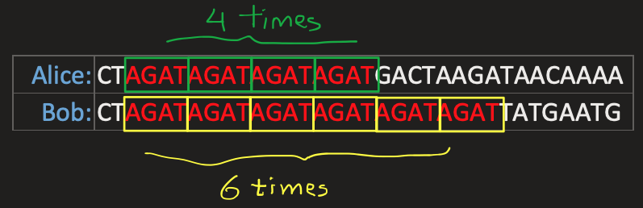

# *DNA Profiler*

<sup>Última atualização: 26/05/2022</sup>

## Sumário

- [Introdução](#introdução)  
- [Tarefas](#tarefas)
- [Arquivos de entrada](#arquivos-de-entrada)
- [Exemplos (parciais) de saída](#exemplos-parciais-de-saída)
- [Modelagem do problema](#modelagem-do-problema)
- [Estrutura do projeto](#estrutura-do-projeto)
- [Compilação do programa](#compilação-do-programa)
- [Conhecimentos necessários](#conhecimentos-necessários)
- [Requisitos](#requisitos)
- [Boas práticas de programação](#boas-práticas-de-programação)
- [Autoria e política de colaboração](#autoria-e-política-de-colaboração)
- [Entrega](#entrega)
- [Avaliação](#avaliação)
- [Dúvidas e informações](#dúvidas-e-informações)
- [*Copyright*](#copyright)

## Introdução

O DNA, abreviação em inglês de *deoxyribonucleic acid* (ácido desoxirribonucleico), é um composto orgânico formado por duas cadeias cujas moléculas, chamadas nucleotídeos, contêm as instruções genéticas que coordenam o desenvolvimento e funcionamento de todos os seres vivos e que transmitem as suas características hereditárias. As cadeias do DNA apresentam-se como uma dupla hélice constituída de repetidos pares de nucleotídeos firmemente associados por ligações de hidrogênio. Cada nucleotídeo é composto de uma de quatro bases nitrogenadas: *adenina* (A), *citosina* (C), *guanina* (G) e *timina* (T).

Cada célula humana tem milhões desses nucleotídeos agrupados em sequência. Algumas porções dessa sequência (por exemplo, o genoma) são iguais, ou ao menos muito similares, entre todos os humanos. Contudo, outras partes têm uma alta diversidade genética, variando assim entre as pessoas. Um ponto onde o DNA tende a ser muito diverso é nos chamados [*Short Tandem Repeats* (STRs)](https://en.wikipedia.org/wiki/Microsatellite), também chamados de microsatélites. Um STR é uma sequência curta de DNA que se repete uma determinada quantidade de vezes em lugares específicos do DNA. O número de vezes que um STR se repete (geralmente entre 5 e 50 vezes) varia muito entre as pessoas, promovendo assim alta diversidade genética. No exemplo abaixo, o STR `AGAT`é repetido quatro vezes no DNA de uma pessoa (Alice), enquanto outra pessoa (Bob) tem o mesmo STR repetido seis vezes.



A comparação dos STRs é utilizada principalmente em um processo chamado [*DNA profiling*](https://en.wikipedia.org/wiki/DNA_profiling), também chamado de impressão genética, desenvolvido em 1984 pelo geneticista britânico [Sir Alec Jeffreys](https://pt.wikipedia.org/wiki/Alec_Jeffreys). Através desse processo, cientistas forenses comparam amostras de DNA encontradas, por exemplo, em uma cena de crime com o DNA do suposto criminoso a fim de obter evidência acerca da probabilidade de esse indivíduo estar envolvido no crime. O *DNA profiling* também. é utilizado em testes de paternidade para determinar se um indivíduo é o pai biológico ou a mãe biológica de uma pessoa, com probabilidade de acerto de 99,99%, tornando o método altamente confiável para realizar esse tipo de detecção.

Se múltimos STRs forem usados, ao invés de apenas um único, é possível aumentar a acurácia do processo de *DNA profiling*. Por exemplo, se a probabilidade de duas pessoas terem o mesmo número de repetições de um STR é de 5% e os analistas usam dez diferentes STRs, a probabilidade de duas amostras de DNA serem iguais, apenas por sorte, é de um em um quadrilhão (assumindo que cada STR é independente um do outro). Assim, se duas amostras de DNA têm o mesmo número de repetições de STRs, há alta confiabilidade na detecção de que aquele DNA analisado é proveniente da mesma pessoa. O [CODIS](https://www.fbi.gov/services/laboratory/biometric-analysis/codis/codis-and-ndis-fact-sheet), a base de dados do *Federal Bureau of Investigation* (FBI) dos EUA, usa 20 diferentes STRs como parte da análise de amostras de DNA.

Na forma mais simples, uma base de dados de DNA pode ser formatada em um arquivo de texto [CSV (valores separados por vírgula)](https://en.wikipedia.org/wiki/Comma-separated_values) onde cada linha corresponde a um indivíduo e cada coluna corresponde a um STR particular. Um exemplo de conteúdo desse tipo de arquivo, cuja primeira linha contém cabeçalhos para cada uma das colunas, seria:

```
name,AGAT,AATG,TATC
Alice,28,42,14
Bob,17,22,19
Charlie,36,18,25
```

Nesse exemplo, Alice tem a sequência `AGAT` repetida 28 vezes em algum lugar de seu DNA, bem como as sequências `AATG` e `TATC` repetidas 42 e 14 vezes, respectivamente. De forma similar, essas sequências encontram-se repetidas 17, 22 e 19 vezes no DNA de Bob e 36, 18 e 25 vezes no DNA de Charlie.

Dada uma sequência de DNA, como um investigador poderia, através do *DNA profiling* identificar quem é o seu dono? Suponha que se busque na sequência de DNA pela sequência mais longa de `AGAT` e se encontre que ela tem tamanho 17, ou seja, uma sequência de 17 ocorrências de `AGAT` consecutivas. O processo é então repetido para `AATG` e para `TATC` e se descobre que elas se repetem 22 e 19 vezes. Com isso, conclui-se pela probabilidade de que o DNA analisado pertença a Bob.

## Tarefas

Escreva um programa chamado `dnaprofiler` que realiza o processamento de DNA e executa o processo de *DNA profiling*. O programa deverá receber via linha de comando duas entradas representando dois arquivos. O primeiro arquivo, no formato CSV, contém uma base de dados de DNA, e o segundo é um arquivo de texto contendo a sequência de DNA que deve ser verificada. O programa deverá então processar as entradas, realizar o *profiling* (isto é, procurar pela sequência mais longa com consecutivos STRs) e comparar com a base de dados fornecida como entrada, procurando se o perfil resultante do processamento está presente na base de dados. Caso o perfil seja encontrado, o programa deverá imprimir na saída padrão o nome da pessoa identificada. Caso negativo, o programa deverá imprimir a mensagem `Indivíduo não encontrado`, indicando que não foi encontrado nenhuma pessoa na base de dados correspondendo às características encontradas.

O programa deverá ser executado (inclusive com os argumentos adicionais `-d` e `-s`) da seguinte forma:

```bash
$ ./dna_profiler -d <database_file> -s <dna_sequence_file>
```

sendo `database_file` o arquivo CSV correspondente à base de dados de DNA e `dna_sequence_file` o arquivo de texto com a sequência de DNA que se deseja identificar. Caso os argumentos não sejam fornecidos corretamente, o usuário deverá ser informado acerca do erro e como o programa deve ser executado corretamente.

Uma possível sequência de passos a serem seguidos na implementação do programa *dnaprofiler* seria:

1. Ler a base de dados de DNA e armazenar as informações em uma variável/objeto
2. Ler a sequência de DNA a ser identificada e armazenar em outra variável/objeto
3. Gerar o perfil da sequência de DNA carregada
4. Procurar pelo perfil gerado na base de dados de DNA
     1. Se o indivíduo for encontrado, imprimir na saída padrão seu nome e exibir os STRs
     2. Se o indivíduo não for encontrado, imprimir a mensagem *no match found*

O programa deverá exibir mensagens informativas ao usuário à medida em que cada um desses passos vai sendo executado (veja [exemplos (parciais) de saída](#exemplos-parciais-de-saída)).

## Arquivos de entrada

A base de dados de DNA, fornecida como um arquivo no formato CSV, é basicamente uma tabela em que:

1. a primeira linha contém os nomes das colunas separadas por `,` (vírgula);
2. na primeira linha, a primeira coluna é sempre `name` seguida por uma quantidade *n* de STRs que devem ser considerados ao analisar as sequências de entrada, e;
3. as linhas seguintes, **em quantidade não determinada**, contêm cada uma o nome de um indivíduo e seu perfil de DNA correspondente, na forma do número máximo que uma sequência de STRs repetidos aparecem em seu DNA.

Para o exemplo anteriormente apresentado, o arquivo CSV fornecido como entrada representa a tabela abaixo:

| name    | `AGAT` | `AATG` | `TATC` |
|:------ :| ------:|-------:|-------:|
| Alice   | 28 | 42 | 14 |
| Bob     | 17 | 22 | 19 |
| Charlie | 36 | 18 | 25 |

O segundo arquivo de texto representa o segmento de DNA do indivíduo que deve ser analisado.

De acordo com o programa, este segmento do DNA pertenceria a Alice:
> AGACGGGTTACCATGACTATCTATCTATCTATCTATCTATCTATCTATCACGTACGTACGTATCGAGATAGATAGATAGATAGATCCTCGACTTCGATCGCAATGAATGCCAATAGACAAAA

Este segmento de DNA pertenceria a Bob:
> AACCCTGCGCGCGCGCGATCTATCTATCTATCTATCCAGCATTAGCTAGCATCAAGATAGATAGATGAATTTCGAAATGAATGAATGAATGAATGAATGAATG

Este segmento de DNA pertenceria a Charlie:
> CCAGATAGATAGATAGATAGATAGATGTCACAGGGATGCTGAGGGCTGCTTCGTACGTACTCCTGATTTCGGGGATCGCTGACACTAATGCGTGCGAGCGGATCGATCTCTATCTATCTATCTATCTATCCTATAGCATAGACATCCAGATAGATAGATC

Os arquivos referentes à base de dados e aos segmentos de DNA a serem analisados estão disponíveis no diretório [`data`](data).

## Exemplos (parciais) de saída

Exemplo de sequência de DNA encontrada na base de dados:

```
$ ./dnaprofiler -d data/data.csv -s data/sequence_alice.txt
DNA Profiler
Este programa carrega uma base de dados de DNA e uma sequência desconhecida de DNA 
e tenta identificar a que indivíduo esse segmento de DNA provavelmente pertence

> Carregando a base de dados de DNA [data/data.csv]...
> Carregando a sequência de DNA desconhecida [data/sequence_alice.txt]...
> Arquivos de entrada carregados com sucesso.

> Processando dados, aguarde...
> Realizando DNA profiling...

Indivíduo encontrado: Alice
DNA Profile:
                  TATC [x8]                                       AGAT [x5]                           AATG [x2]
                  vvvvvvvvvvvvvvvvvvvvvvvvvvvvvvvv                vvvvvvvvvvvvvvvvvvvv                vvvvvvvv
[AGACGGGTTACCATGACTATCTATCTATCTATCTATCTATCTATCTATCACGTACGTACGTATCGAGATAGATAGATAGATAGATCCTCGACTTCGATCGCAATGAATGCCAATAGACAAAA]
```

Exemplo de sequência de DNA não encontrada na base de dados:

```
$ ./dnaprofiler -d data/data.csv -s data/sequence_no_match.txt
DNA Profiler
Este programa carrega uma base de dados de DNA e uma sequência desconhecida de DNA 
e tenta identificar a que indivíduo esse segmento de DNA provavelmente pertence

> Carregando a base de dados de DNA [data/data.csv]...
> Carregando a sequência de DNA desconhecida [data/sequence_no_match.txt]...
> Arquivos de entrada carregados com sucesso.

> Processando dados, aguarde...
> Realizando DNA profiling...

Indivíduo não encontrado
```

## Modelagem do problema

**Pelo menos três classes** devem ser modeladas para o programa `dnaprofiler`:

1. uma classe para armazenar a base de dados e realizar busca por perfis;
2. uma classe para armazenar a informação de DNA de um indivíduo, bem como realizar o perfil com base em algum STR (ou conjunto de STRs), e;
3. uma classe para centralizar as saídas para o usuário.

## Estrutura do projeto

Primando pela modularização, a definição e a implementação das classes deverão ser separadas em arquivos cabeçalho (`.h`) e de corpo (`cpp`). **Necessariamente**, os arquivos de cabeçalho deverão estar presentes no diretório `include` e os arquivos de corpo no diretório `src`. Além desses arquivos, o arquivo `main.cpp` correspondente à implementação da função principal do programa deverá **necessariamente** estar também presente no diretório `src`. Dessa forma, os arquivos deste projeto deverão estar organizados de acordo com a seguinte estrutura:

```
+─dnaprofiler         ---> Nome do diretório do projeto
  ├─── CMakeLists.txt ---> Script de configuração do cmake
  ├─── build          ---> Diretório onde os arquivos executáveis serão gerados
  ├─── data           ---> Diretório com os arquivos de entrada
  ├─── include        ---> Diretório que contém os arquivos cabeçalho (.h)
  └─── src            ---> Diretório que contém os arquivos corpo (.cpp)
       └─── main.cpp  ---> Arquivo fonte contendo a implementação da função principal do programa
```

A diretiva `add_executable` do *script* de configuração do `cmake`[`CMakeLists.txt`](CMakeLists.txt) deverá ser modificado adicionando, logo após o arquivo `main.cpp`, todos os arquivos corpo que forem implementados para as classes criadas.

## Compilação do programa

Os seguintes comandos devem ser executados no terminal do sistema operacional para compilar o programa:

```bash
mkdir build
cd build
cmake ..
cmake --build .
```

Com isso, o executável `dnaprofiler` resultante da compilação do programa será gerado dentro do diretório `build`.

## Conhecimentos necessários

- Saída formatada via saída padrão
- Entrada via leitura de arquivos
- Laços
- Estruturas condicionais e expressões lógicas
- Manipulação de *strings*
- Classes e objetos
- Visibilidade de membros de classes
- *Containers* da [*Standard Template Library* (STL)](https://www.cplusplus.com/reference/stl/)

## Requisitos

Para a realização desta atividade, os seguintes elementos devem estar devidamente instalados no ambiente de desenvolvimento:

- [Git](https://git-scm.com), como sistema de controle de versões
- [*GNU Compiler Collection*](https://gcc.gnu.org) (a qual inclui o compilador `g++`), [`clang`](https://clang.llvm.org/) ou qualquer outro compilador para a linguagem C++
- [`cmake`](https://cmake.org/), para gerar *makefiles* automaticamente e de forma otimizada para o projeto

## Boas práticas de programação

Boas práticas de programação deverão ser constantemente aplicadas no desenvolvimento do programa. O código fonte deverá estar legível (com indentação de código fonte, nomes consistentes etc.) e documentado adequadamente na forma de comentários. O código fonte deverá ainda ser anotado para dar suporte à geração automática de documentação utilizando a ferramenta [Doxygen](https://www.doxygen.nl/). O documento de apoio disponível neste [*link*](https://drive.google.com/file/d/1YA1KxASCNY3B8APowD2V0sL-kAso9g86/view) contém algumas instruções acerca do padrão de documentação e uso do Doxygen.

## Autoria e política de colaboração

**Este trabalho deverá necessariamente ser realizado em equipe composta de dois estudantes**, sendo importante, dentro do possível, dividir as tarefas igualmente entre os integrantes da equipe. Após a implementação do programa, o arquivo [`author.md`](author.md) presente no repositório deverá ser editado preenchendo as informações de identificação dos integrantes da equipe, na seção [Informações de Autoria](author.md#identificação-de-autoria).

O trabalho em cooperação entre estudantes da mesma turma ou de outras turmas é estimulado, sendo admissível a discussão de ideias e estratégias. Contudo, tal interação não deve ser entendida como permissão para utilização de (parte de) código fonte de colegas, o que pode caracterizar situação de plágio. Trabalhos copiados no todo ou em parte de outros colegas ou da Internet serão anulados e receberão nota zero.

## Entrega

O sistema de controle de versões [Git](https://git-scm.com) e o serviço de hospedagem de repositórios [GitHub](https://git-scm.com) serão utilizados para possibilitar a entrega das implementações realizadas. Para possibilitar a associação de repositórios Git para cada equipe e reuni-los sob uma mesma infraestrutura, foi criada uma atividade (*assignment*) no GitHub Classroom. Cada integrante de equipe deverá acessar este [*link*](https://classroom.github.com/a/gvcyN6JZ), aceitar o convite para ingressar no GitHub Classroom e finalmente seguir as instruções em tela para acessar a atividade e ingressar em uma equipe existente ou criar outra. Este [vídeo](https://youtu.be/ObaFRGp_Eko) demonstra como ocorre esse processo.

No momento de criação de uma equipe, o GitHub Classroom cria um repositório Git privado acessível unicamente pelos integrantes da equipe e pelo docente, sob a organização [`bti-ufrn-lp1`](https://github.com/bti-ufrn-lp1). Esse repositório segue a mesma estrutura de diretórios presentes neste repositório, o qual serve de *template*. Todos os arquivos deverão constar no repositório obedecendo **estritamente** a divisão em diretórios, ou seja, os códigos fonte referentes ao problema implementado deverão estar nos respectivos diretórios. A fim de garantir a boa manutenção do repositório, deve-se ainda configurar corretamente o arquivo `.gitignore` para desconsiderar arquivos que não devam ser versionados, a exemplo do diretório `build` e seus arquivos, resultantes do processo de compilação com o `cmake`.

A entrega da implementação deste trabalho deverá ser realizada **até as 23h59 do dia 10 de junho de 2022** no respectivo repositório Git da equipe. Para fins de registro, o endereço do repositório também deverá ser enviado através da opção *Tarefas* na Turma Virtual do SIGAA. **Não serão aceitos envios por outros meios ou repositórios que não sejam os descritos nesta especificação.**

## Avaliação

A avaliação da implementação deste trabalho contabilizará nota de até 10,0 pontos. A implementação será avaliada de acordo com os seguintes critérios:

- utilização correta dos recursos providos pela linguagem de programação C++;
- modelagem adequada de classes e utilização correta de objetos;
- corretude da execução do programa implementado, que deve apresentar saída em conformidade com a especificação e as entradas de dados fornecidas;
- aplicação de boas práticas de programação, incluindo legibilidade, organização e documentação de código fonte, e;
- correta utilização do repositório Git, no qual deverá ser registrado todo o histórico da implementação por meio de *commits*.

O não cumprimento de algum dos critérios de avaliação especificados poderá resultar nos seguintes decréscimos, aplicados sobre a nota obtida até então na avaliação da implementação:

| Falta | Decréscimo |
| :--- | ---: |
| Falta de comentários no código fonte e/ou de documentação gerada com Doxygen | -10% |
| Uso inadequado de controle de versão com Git | -20% |
| Falta de especificação ou especificação incorreta da autoria do trabalho (arquivo [`author.md`](author.md)) | -20% |
| Implementação na linguagem C ou resultante de mistura entre as linguagens C e C++ | -30% |
| Código fonte com legibilidade prejudicada (por exemplo, com identação ou nomenclatura inadequada) | -40% |
| Programa compila com mensagens de aviso (*warnings*) | -50% |
| Modelagem orientada a objetos inadequada | -50% |
| Programa apresenta erros de compilação, não executa ou apresenta saída incorreta | -70% |
| Plagiarismo | -100% |

## Dúvidas e informações

Caso haja qualquer dúvida, questionamento ou necessidade de informação adicional, é possível:

- enviar *e-mail* para o endereço everton.cavalcante@ufrn.br;
- enviar mensagem privada diretamente ao docente, utilizando o servidor Discord;
- enviar mensagem no canal de texto `#geral-dim0120-t02`, especificamente associado à turma no servidor Discord;
- enviar mensagem no canal de texto `#duvidas` no servidor Discord, comum a todas as turmas da disciplina;
- realizar encontros síncronos presenciais, no horário e local de aula;
- agendar encontros síncronos por videoconferência, ou;
- agendar encontros síncronos pelo canal de áudio `Fale com Prof. Everton` no servidor Discord.

## *Copyright*

Esta atividade é uma tradução, com adaptações, de um [projeto de programação em Python](http://nifty.stanford.edu/2020/dna/), originalmente de autoria de Brian Yu e David J. Malan, da Harvard University, EUA. A tradução e as adaptações foram feitas pelos professores Selan R. Santos (selan@dimap.ufrn.br), Julio Melo (julio@imd.ufrn.br) e Everton Cavalcante (everton.cavalcante@ufrn.br).
